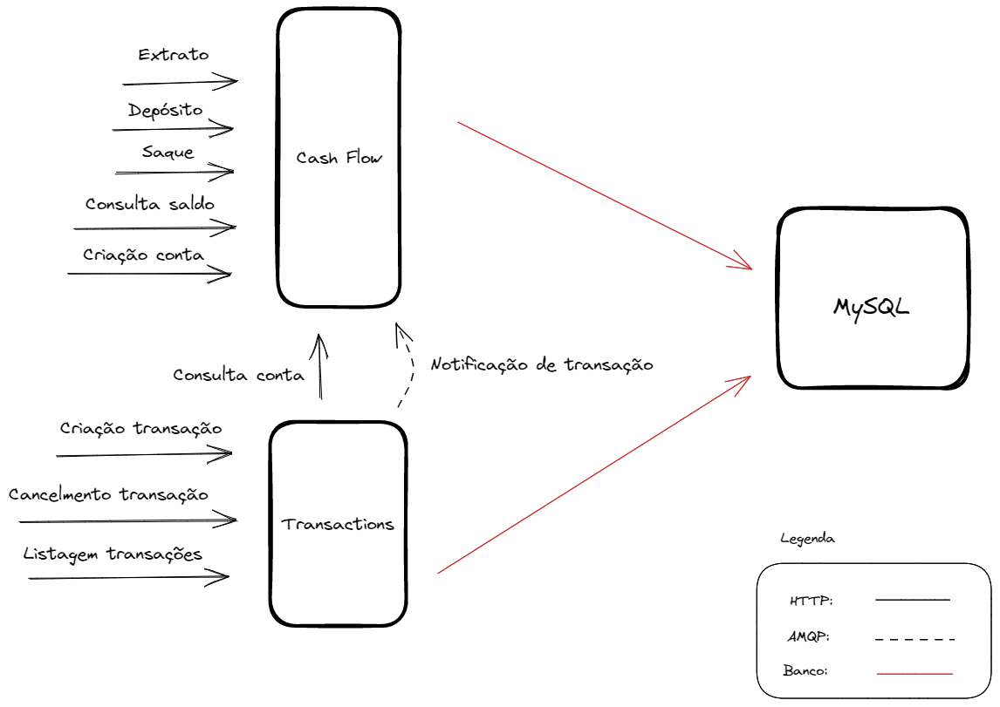

# PicPay Wallet

Solução para carteira digital do processo seletivo do PicPay.

## Solução

A solução consiste em dois microsserviços onde é possivel realizar as seguintes operações

* Saque e depósito
* Consulta de saldo
* Extrato
* Criação de conta
* Criação e cancelamento de transação
* Listagem de transações

A premissa de ambos microsserviços é que eles sejam agnósticos em relação fonte das operações. Isso significa que as operações de saque e depósito podem ser realizadas tanto por algum método digital quanto por um ATM, como algumas carteiras digitais permitem fazer. Da mesma forma, as transações podem vir direto de estabelecimentos comerciais físicos como de ecommerces. Essa premissa assume que a solução proposta não é um BFF para as interfaces finais dos clientes, mas sim a última parada das operações antes de serem concluídas.

## Arquitetura

Conforme mostrado na figura acima, há dois microsserviços: Cash Flow e Transactions. Os dois realizam ou recebem tanto operações via HTTP quanto via AMQP. Ambos se conectam á mesma instância do banco MySQL e usam ele como única fonte persistente de dados.  

### Cash Flow
Esse serviço é responsável pelas operações de saque,depósito, criação de conta, extrato e consulta de saldo. Ele tambem reage a criações e cancelamentos de transações via AMQP, a fim de alterar o saldo. O Cash Flow é responsável pelas tabelas account(registro de contas) e history(histórico de movimentações) no banco de dados MySQL.

### Transactions
Esse serviço é responsável pelas operações de criação, cancelamento e listagem de transações. Via HTTP e AMQP ele se comunica com o Cash Flow para possibilitar que as operações ocorram da melhor forma possível e com rapidez. Ele é tambem o responsável por emitir o evento de criação e cancelamento de transações, escutado pelo Cash Flow. O Transactions é responsável pela tabela transaction(registro de transações) no banco de dados MySQL.

## Como rodar o projeto

Ambos os projetos se encontram no mesmo repositório, sendo a raíz a localização do arquivo docker-compose.yml para levantar todos os dois serviços, o RabbitMQ e o MySQL. É necessário criar um arquivo .env na raíz com as seguintes variáveis de ambiente:

* `CASH_FLOW_PORT`: Porta do Cash Flow
* `TRANSACTIONS_PORT`: Porta do Transactions
* `DB_HOST`: Host do MySQL
* `DB_PORT`: Porta do MySQL
* `DB_USER`: Usuário do MySQL
* `DB_PASSWORD`: Senha do MySQL
* `DB_NAME`: Nome do schema do MySQL
* `RABBIT_URL`: URL do RabbitMQ
* `CASH_FLOW_URL`: URL base do Cash Flow

Após essa configuração, basta executar `docker-compose --env-file .env up -d` e aguardar todos os serviços subirem. O Swagger do Cash Flow estará localizado em http://localhost:`CASH_FLOW_PORT`/docs e do Transactions em http://localhost:`TRANSACTIONS_PORT`/docs

## Como rodar os testes

O projeto possui testes unitários e alguns testes integrados.

### Testes unitários

 Para rodar os teste unitários, estando na raíz do projeto, execute os seguintes passos no terminal:

Para o Cash Flow:
 * `cd cash-flow`
 * `npm ci`
 * `npm t` 

 Para o Transactions:
 * `cd transactions`
 * `npm ci`
 * `npm t` 

### Teste integrados
Os testes integrados exigem um .env na raíz de cada um dos serviços. Use o .env-example de cada serviço para isso. É importante tambem ressaltar que os testes integrados do Transactions exigem que o Cash Flow esteja operante. Para executar os testes integrados, estando na raíz do projeto, execute os seguintes passos no terminal:

Para o Cash Flow:
 * `docker-compose up -d rabbitmq db`
 * `cd cash-flow`
 * `npm ci`
 * `npm run test:e2e`

 Para o Transactions:
 * `docker-compose up -d rabbitmq db`
 * `cd cash-flow`
 * `npm ci`
 * `npm run start:dev`
 * `cd..`
 * `cd transactions` 
 * `npm ci`
 * `npm run test:e2e`

## Overview Técnico

* Node JS 18.13.0
* Nest JS 9
* RabbitMQ 3.8
* MySQL 8
* Arquitetura limpa
* Microsserviços